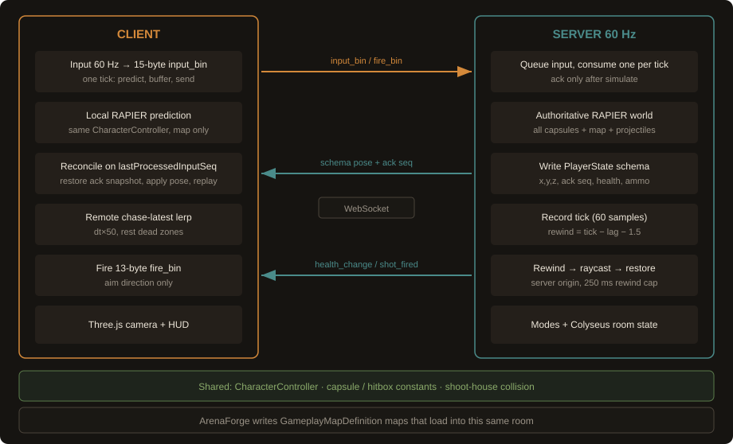

# CyberRunner

Browser multiplayer FPS. The server owns movement and hits. The client predicts locally and reconciles on each ack.

**Play:** [game.cyberrunnergame.dev](https://game.cyberrunnergame.dev)

Guest play works. Two tabs can share a Deathmatch with the 6-letter HUD code.



## Engineering highlights

- Fixed **60 Hz** authoritative RAPIER simulation. Scheduler jitter does not change movement `dt`.
- Client prediction plus reconciliation: restore the ack-tick controller snapshot, apply the server pose, replay only newer commands.
- Ordered server input queue (max 24). Ack is the last seq that was actually simulated. Overflow disconnects with `4002`.
- Shared `CharacterController`, capsule, and shoot-house colliders in `shared/`. The prediction world is the local capsule and the map only.
- Bounded server-owned hitscan rewind: RTT/2 plus 1.5 ticks, capped at 250 ms. Shot origin comes from history. Aim is client-originated and sanitized.
- Compact binary hot path: 15-byte `INPUT_CMD`, 13-byte `FIRE_CMD`.
- F3 overlay for RTT, seq/ack, pending replay, correction, and predicted vs server move state.

## Netcode

**Movement**

1. Client samples input on a 60 Hz tick and assigns a unique seq.
2. Local RAPIER applies that command and stores a controller snapshot.
3. The same command is sent as `input_bin`.
4. Server queues it, applies one command per sim tick, writes `PlayerState`, acks `lastProcessedInputSeq`.
5. Client restores the snapshot for that ack, applies the server pose, replays leftovers once, then smooths the camera.

**Firing**

1. Client sends `fire_bin` (fire flag + aim).
2. Server derives shot origin from rewind history.
3. Other players are moved to the estimated view tick, the ray runs, bodies restore in `try/finally`.
4. Damage, ammo, and `shot_fired` are server-owned.

## Measured results

From `npm run benchmark` on 2026-08-29 (Node v23.11.0, Windows, i9-14900KF). Raw file: [`benchmarks/latest.json`](benchmarks/latest.json). Method: [`benchmarks/README.md`](benchmarks/README.md).

These are local synthetic numbers, not a production load test.

| Item | Value | Kind |
|------|-------|------|
| `INPUT_CMD` size | 15 bytes | measured (`encodeInputCmd`) |
| `FIRE_CMD` size | 13 bytes | measured (`encodeFireCmd`) |
| Same input as UTF-8 JSON | 177 bytes | measured (`JSON.stringify`) |
| Same fire as UTF-8 JSON | 47 bytes | measured (`JSON.stringify`) |
| 60 Hz input payload | 900 B/s (54 KB/min) | calculated from 15 × 60 |
| Payload + RFC 6455 masked frame | 1260 B/s | estimate (2-byte header + 4-byte mask). TLS, TCP, IP, and Colyseus wrappers are not included |
| Pending inputs at 0 / 50 / 100 / 150 ms | 0 / 3 / 6 / 9 ticks | synthetic_local: `LocalPlayer` vs a local `PhysicsWorld`, delayed ack, 180 ticks |
| Mean correction in that harness | 0 / 0.02 / 0.03 / 0.04 mm | synthetic_local. Not a browser tab against a Colyseus room |
| Tick time, 1 / 4 / 8 capsules | mean 0.017 / 0.054 / 0.151 ms | synthetic_local: RAPIER + controller only. No sockets, rewind, or broadcast |

## Debugging / demo

**F3** in a match, or `debug.overlay()` in the console. Hidden by default.

Shows client RTT, FPS, `60 Hz (fixed)`, input send rate, local seq, last ack, pending count, correction, and predicted vs server movement state.

While it is on: teal predicted capsule, orange server capsule, aim ray, last server shot ray, remote hitboxes, name labels.

## Gameplay

- Public map: Shoot House Neon. Create Game picks mode and this production map. The server owns `mapId`.
- Modes: Deathmatch (first to 5 kills, 10 min) and Search & Destroy (3 lives, first to 3 rounds)
- Eight weapons, hitscan and projectile
- Crouch, prone, and slide. Crouch and prone resize the movement capsule
- `map-contract-smoke` is an internal fixture. It is not in the Create Game picker.

## ArenaForge

ArenaForge is a bounded AI level-design agent inside CyberRunner. It edits the game's real map structures, checks geometry/navigation/spawn/LOS deterministically, runs a seeded scripted playtest to observe route behavior, and can revise the map before launching the result into the real multiplayer runtime.

**Recorded demo:** Lobby → Arena Forge → recorded run → Play Result. Works immediately. No model key.

**Live local:** self-host with an OpenAI or Anthropic server credential. See [`docs/arena-forge-live.md`](docs/arena-forge-live.md).

**Hosted live:** optional, authenticated and quota-backed, disabled unless configured.

The recorded P5 run is existing OpenAI evaluation evidence. Live OpenAI and Anthropic adapters share the same tool loop. That is runtime compatibility, not a claim that the providers match.

The cinematic camera is presentation only. The scripted playtest is an offline navigation proxy, not live GameRoom bots and not a balance score.

Evaluation method and numbers: [`server/arena-forge-playtest.md`](server/arena-forge-playtest.md), [`server/arena-forge-evaluation.md`](server/arena-forge-evaluation.md), [`server/arena-forge-evaluation-p4b.md`](server/arena-forge-evaluation-p4b.md).

## Run locally

```bash
npm install
npm test
npm run benchmark
npm run dev:server    # ws://localhost:2567
npm run dev:client    # http://localhost:5173
```

```bash
npm run build
npm run preview       # serves client/dist from the Node process
```

Two tabs can join the same Deathmatch with the HUD join code.

Default public map is `shoot-house-neon`. Create Game sends that `mapId`. To boot the internal contract fixture instead (Windows), set `MAP_ID` on the server. The client still reads `mapId` from room state. There is no Create Game card for the fixture.

```powershell
$env:MAP_ID = "map-contract-smoke"; npm run dev:server
npm run dev:client
```

| Variable | Default | Role |
|----------|---------|------|
| `PORT` | 2567 | Listen port |
| `HOST` | `0.0.0.0` locally, `127.0.0.1` in production | Bind address |
| `MAX_PLAYERS` | 8 | Per room |
| `MAP_ID` | shoot-house-neon | Collision and spawn set |
| `NODE_ENV` | unset locally | `production` ignores god mode, unlimited ammo, and `apply_damage` |
| `VITE_WS_URL` | unset | Force the client WebSocket URL |
| `VITE_GOOGLE_CLIENT_ID` | unset | Google sign-in. Guest play works if this is unset |
| `OPENAI_API_KEY` | unset | Server-only OpenAI key for live Forge. Never put this in client env |
| `ANTHROPIC_API_KEY` | unset | Server-only Anthropic key for live Forge. Never put this in client env |
| `ARENA_FORGE_PROVIDER` | `openai` | `openai` or `anthropic`. Server-only |
| `ARENA_FORGE_LIVE_AGENT_ENABLED` | unset | Must be `true` plus the selected provider key before Forge can start a live job |

Live local setup: [`docs/arena-forge-live.md`](docs/arena-forge-live.md). `npm run forge:doctor` checks configuration without calling a model.

Copy `server/.env.example` to `server/.env` for the server. Copy `client/.env.example` to `client/.env.local` if you want local Vite overrides.

Production (Caddy, systemd, Postgres): [`server/DEPLOY.md`](server/DEPLOY.md).

Code is ISC. See `LICENSE`. Shipped media notes: [`ASSETS.md`](ASSETS.md).

## Tech

| Layer | Choice |
|-------|--------|
| Render | Three.js |
| Physics | RAPIER 3D (WASM), client and server |
| Rooms | Colyseus schema sync plus binary `input_bin` / `fire_bin` |
| Server | Node.js, Express, optional Postgres + Google OAuth |
| Client build | Vite + TypeScript |
| Hosting | DigitalOcean, Caddy (HTTPS), systemd |

## Limitations

- Single-region, small-room deploy. Default cap is 8 players. No matchmaking service.
- Remotes use chase-latest lerp, not a delayed snapshot buffer.
- Client prediction does not collide with other players.
- Hitscan rewinds. Projectiles and explosions use current poses.
- Aim direction is client-trusted after a sanity check.
- `seq` is `u32`. A wrap would take about 2 years at 60 Hz and is not handled.
